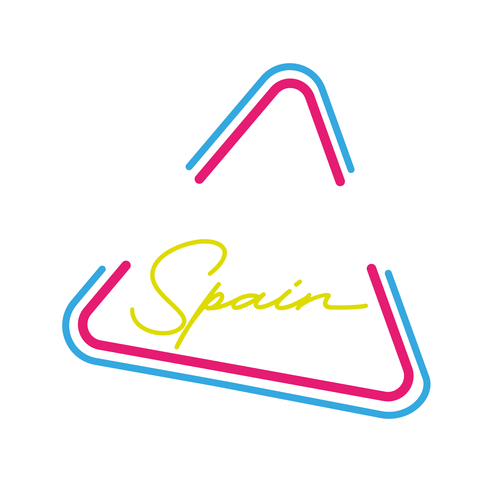
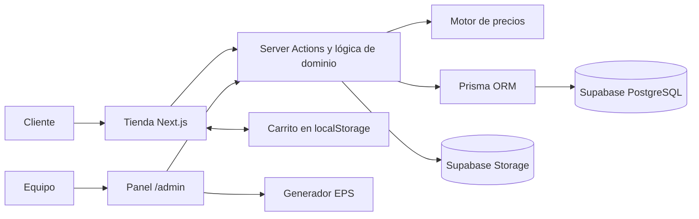

<div align="center">
  

  # Neon Led Spain

  **E-commerce full-stack de neones LED personalizados, fabricados en Mallorca.**

  Diseña el neón, visualízalo encendido y calcula su precio al instante.

  [](https://nextjs.org/)
  [](https://react.dev/)
  [](https://www.typescriptlang.org/)
  [](https://www.prisma.io/)
  [](https://supabase.com/)
  [](https://www.docker.com/)

  [Ver la web](https://neonledspain.llucbosch.com/) · [Probar el configurador](https://neonledspain.llucbosch.com/personalizar) · [Explorar el catálogo](https://neonledspain.llucbosch.com/productos)
</div>

---

## Sobre el proyecto

Neon Led Spain digitaliza de principio a fin la venta y fabricación de rótulos de neón LED. El cliente puede crear un diseño de texto, elegir tipografía, color, tamaño, soporte, uso interior o exterior y plazo de entrega mientras ve una previsualización y un precio actualizados en tiempo real.

La aplicación también incorpora catálogo, carrito, checkout, solicitudes de diseños basados en logos o bocetos y un panel privado desde el que el equipo gestiona productos, tarifas, pedidos, presupuestos, usuarios y archivos de producción.

> [!IMPORTANT]
> El checkout ya valida los datos, recalcula cada importe en el servidor y registra el pedido, pero todavía no realiza el cobro online. La integración de Stripe y los correos transaccionales con Resend son las siguientes fases del proyecto.

<p align="center">
  
  
  
</p>

## Funcionalidades

### Experiencia de compra

- Configurador de texto con previsualización realista, 18 tipografías y fondos ambientales.
- Colores fijos y modo RGB multicolor, diferentes tamaños, soportes y acabado IP65.
- Precio y ficha técnica en directo: metros de tubo, superficie de acrílico y consumo estimado.
- Catálogo filtrable con productos de texto, diseños SVG y opciones personalizables.
- Carrito persistente con desglose de precio y configuración completa de cada pieza.
- Checkout para particulares y empresas, direcciones separadas, NIF/NIE/CIF y portes configurables.
- Solicitudes a medida mediante la subida de un logo, una imagen o un boceto.
- Confirmación con referencia de pedido legible (`NLS-AAAA-NNNN`).

### Operaciones y administración

- Dashboard de pedidos, facturación, productos y solicitudes pendientes.
- Gestión de estados de pedido y presupuestos personalizados.
- Alta y baja de productos de texto o vectoriales con previsualización compartida con la tienda.
- Tarifas, suplementos, plazos y gastos de envío editables sin desplegar código.
- Exportación EPS a tamaño real y con el texto trazado a curvas para fabricación.
- Valoración de Trustpilot editable y revalidación inmediata del contenido público.
- Manual de uso integrado e imprimible desde el propio panel.
- Administración multiusuario protegida con scrypt, 2FA TOTP obligatorio, sesiones revocables y limitación de intentos.

## Stack tecnológico

| Área | Tecnología |
| --- | --- |
| Aplicación | Next.js 16 App Router, React 19 y TypeScript 5 |
| Interfaz | Tailwind CSS 4 y Framer Motion |
| Datos | PostgreSQL en Supabase y Prisma ORM 7 |
| Archivos | Supabase Storage |
| Validación y seguridad | Server Actions, scrypt, TOTP y cookies `httpOnly` |
| Producción | Docker multi-stage, salida standalone y Nginx Proxy Manager |

## Arquitectura



Las reglas sensibles viven en el servidor: el navegador envía la configuración del artículo, pero los precios, portes y totales se validan y recalculan antes de crear el pedido.

## Estructura del proyecto

```text
neonweb/
├── app/
│   ├── (shop)/              # Tienda, catálogo, carrito y checkout
│   └── admin/               # Backoffice y autenticación interna
├── components/
│   ├── neon/                # Configurador y componentes visuales
│   ├── shop/                # Componentes de la tienda
│   └── admin/               # Formularios y controles del panel
├── lib/                     # Dominio, precios, acceso a datos y seguridad
├── prisma/                  # Esquema y datos iniciales
├── public/                  # Marca, galería y fondos optimizados
├── scripts/                 # Preparación de Storage y credenciales
├── Dockerfile
└── docker-compose.yml
```

## Puesta en marcha

### Requisitos

- [Node.js 22](https://nodejs.org/) o superior.
- npm 10 o superior.
- Un proyecto de [Supabase](https://supabase.com/) con PostgreSQL y Storage.

### 1. Instalar el proyecto

```bash
git clone https://github.com/lluc898/neonweb.git
cd neonweb
npm ci
```

El script `postinstall` genera automáticamente el cliente de Prisma.

### 2. Configurar las variables de entorno

```bash
cp .env.example .env
```

En PowerShell, utiliza `Copy-Item .env.example .env`. Después completa:

| Variable | Uso | Exposición |
| --- | --- | --- |
| `DATABASE_URL` | Conexión PostgreSQL usada por Prisma | Solo servidor |
| `NEXT_PUBLIC_SUPABASE_URL` | URL del proyecto de Supabase | Pública |
| `NEXT_PUBLIC_SUPABASE_ANON_KEY` | Clave pública de Supabase | Pública |
| `SUPABASE_SERVICE_ROLE_KEY` | Operaciones privilegiadas de Storage | Secreta |
| `ADMIN_PASSWORD_HASH` | Contraseña inicial del superadministrador | Secreta |

> [!CAUTION]
> No publiques `.env`, `SUPABASE_SERVICE_ROLE_KEY` ni `ADMIN_PASSWORD_HASH`. El repositorio solo debe contener `.env.example` con valores ficticios.

Si el host directo de Supabase no es accesible desde una red IPv4, usa la cadena del **Session pooler** en el puerto `5432` como `DATABASE_URL`.

### 3. Preparar la base de datos y Storage

Genera primero el hash de la contraseña inicial:

```bash
npx tsx scripts/hash-admin-password.mts "una-contraseña-larga-y-unica"
```

Copia el resultado en `ADMIN_PASSWORD_HASH` y ejecuta:

```bash
npx prisma db push
npm run db:seed
npx tsx scripts/setup-storage.mts
```

El seed es idempotente: crea las categorías, productos, tarifas y el usuario `admin` sin sobrescribir datos existentes. El script de Storage crea los buckets públicos `disenos` y `productos`.

> [!NOTE]
> Con el Session pooler de Supabase se recomienda `prisma db push`; `prisma migrate dev` necesita una shadow database y puede fallar en ese entorno.

### 4. Iniciar el entorno de desarrollo

```bash
npm run dev
```

Abre [http://localhost:3000](http://localhost:3000). El panel está disponible en [http://localhost:3000/admin](http://localhost:3000/admin); en el primer acceso tendrás que vincular una aplicación TOTP mediante el código QR.

## Comandos disponibles

| Comando | Descripción |
| --- | --- |
| `npm run dev` | Inicia el servidor de desarrollo |
| `npm run build` | Genera el build optimizado de producción |
| `npm start` | Ejecuta el build de producción |
| `npm run lint` | Analiza el código con ESLint |
| `npm run db:seed` | Inserta o actualiza los datos iniciales |
| `npm run db:studio` | Abre Prisma Studio |
| `npx prisma db push` | Sincroniza el esquema con la base de datos |
| `npx tsx scripts/setup-storage.mts` | Crea los buckets necesarios en Supabase |

## Rutas principales

| Ruta | Descripción |
| --- | --- |
| `/` | Portada, productos destacados y configurador |
| `/productos` | Catálogo con filtros y paginación |
| `/productos/[slug]` | Ficha y personalización de producto |
| `/personalizar` | Configurador completo de texto |
| `/diseno-a-medida` | Solicitud de presupuesto con archivo adjunto |
| `/carrito` | Carrito y ficha técnica de los artículos |
| `/checkout` | Datos de cliente, envío y creación del pedido |
| `/pedido/[numero]` | Confirmación del pedido |
| `/faq` | Preguntas frecuentes |
| `/admin` | Panel privado de gestión |

## Despliegue

### Node.js

```bash
npm ci
npm run build
npm start
```

Next.js genera una salida `standalone`, apropiada para ejecutarse detrás de un reverse proxy con HTTPS.

### Docker

```bash
docker compose up -d --build
docker compose ps
```

La imagen final se ejecuta con un usuario sin privilegios e incluye un healthcheck HTTP. El `docker-compose.yml` del repositorio está preparado para la red externa `nginx-proxy-manager_default`; adáptala si utilizas otro proxy o una instalación Docker independiente.

Las variables `NEXT_PUBLIC_*` deben estar disponibles durante el build porque Next.js las integra en el bundle del navegador. El resto de secretos se suministran al contenedor en tiempo de ejecución.

## Seguridad

- Cálculo de precios y creación de pedidos exclusivamente en el servidor.
- Contraseñas administrativas derivadas con scrypt; nunca se almacenan en claro.
- 2FA TOTP obligatorio para cada usuario del panel.
- Cookies de sesión `httpOnly`, `SameSite=strict` y `secure` en producción.
- Tokens de sesión aleatorios almacenados únicamente como SHA-256 y revocables desde el panel.
- Limitación persistente de intentos de acceso y protección contra enumeración de usuarios.
- Sanitización de SVG, límites de tamaño y validación de archivos antes de subirlos.
- Cabeceras anti-iframe, `nosniff`, `no-referrer`, `no-store` y `noindex` en administración.

## Estado y próximos pasos

- [x] Configurador con precio y ficha técnica en vivo.
- [x] Catálogo, carrito, checkout y pedidos.
- [x] Diseños a medida con Supabase Storage.
- [x] Panel multiusuario con 2FA y gestión operativa.
- [x] Generación de EPS de producción a tamaño real.
- [ ] Pago online mediante Stripe y webhooks.
- [ ] Confirmaciones y avisos por email con Resend.
- [ ] Fotografías definitivas para todos los productos.
- [ ] Edición completa de productos existentes desde el panel.

Las decisiones de arquitectura, reglas del configurador y contexto técnico detallado se mantienen en [`CLAUDE.md`](./CLAUDE.md).

## Licencia

Este repositorio no incluye actualmente una licencia de software. Salvo indicación expresa, el código y los recursos de marca permanecen bajo los derechos de sus respectivos propietarios.

---

<div align="center">
  Desarrollado para <strong>Neon Led Spain</strong> · Marratxí, Mallorca
</div>
